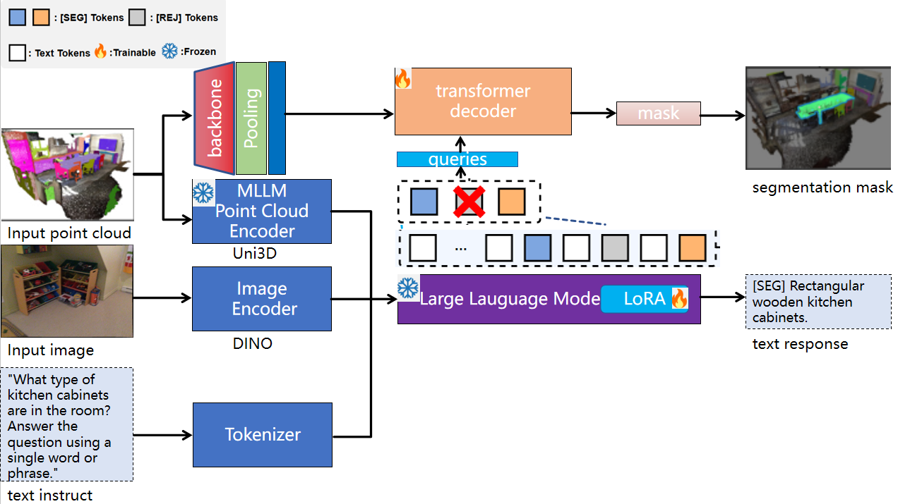

# OpenMaskDINO3D : Reasoning 3D Segmentation via Large Language Model


## 🔥 OpenMaskDINO3D

## Overview

We introduce OpenMaskDINO3D, a multi-modal large language model for 3D scene understanding and instance segmentation, excelling in many 3D tasks.

## Performance

- Performance Comparison of 3D scene understanding tasks:

| Method                | [ScanRefer](https://github.com/daveredrum/ScanRefer) |       | [Scan2Cap](https://github.com/daveredrum/Scan2Cap) |       | [ScanQA](https://github.com/ATR-DBI/ScanQA) |       | [SQA3D](https://github.com/SilongYong/SQA3D) |       |
|:---------------------|:---------:|:-----:|:-------:|:-----:|:-------------------------------------------:|:-----:|:----:|:-----:|
|                      | Acc@0.25  | Acc@0.5 | C@0.5   | B-4@0.5 |                      CIDEr                       | B-4   | EM   | EM-R  |
| Open-MaskDINOSD       | 42.3      | 38.3    | 70.2    | 31.0    |                    75.6                     | 10.7  | -    | 44.1  |
 
- Performance Comparison of 3D instance segmentation tasks:

| Method           | ScanNet 0.25 | ScanNet 0.50 | mIoU  |
|:----------------|:------------:|:------------:|:-----:|
| OpenMaskDINO3D   | 54.21        | 39.14        | 38.91 |

## 🔨 Preparation

- Prepare the environment:
  
  ```shell
  conda create -n openmaskdino3d python=3.10.13
  conda activate openmaskdino3d
  conda install pytorch==2.2.1 torchvision==0.17.1 torchaudio==2.2.1 pytorch-cuda=12.1 -c pytorch -c nvidia
  pip install -r requirements_mask3d.txt
  ```
  
- Download LLM backbone:
  -  We use [Vicuna-7B v1.5](https://huggingface.co/lmsys/vicuna-7b-v1.5) and [Meta-Llama-3-8B](https://huggingface.co/meta-llama/Meta-Llama-3-8B) in our experiments.

  - Change the `llama_model_path` in [config.py](./scripts/config.py) to the path of LLM model.
  

- Annotations and extracted features:
  
  - We use the data preprocess by [Chat-Scene](https://github.com/ZzZZCHS/Chat-Scene), Please follow the instructions in [preprocess](preprocess/).


## 🤖 Training and Inference

- Training
  - Modify [run.sh](scripts/run.sh):
    ```python
    train_tag="scanrefer#scan2cap#scanqa#sqa3d"
    val_tag="scanrefer#scan2cap#scanqa#sqa3d"
    evaluate=False
    ```

    <details>
    <summary> Explanation of "train_tag" and "val_tag" </summary>

    - Use `#` to seperate different datasets

    - Datasets:
      - `scanrefer`: [ScanRefer](https://github.com/daveredrum/ScanRefer) Dataset
      - `scan2cap`: [Scan2Cap](https://github.com/daveredrum/Scan2Cap) Dataset
      - `scanqa`: [ScanQA](https://github.com/ATR-DBI/ScanQA) Dataset
      - `sqa3d`: [SQA3D](https://github.com/SilongYong/SQA3D) Dataset
    </details>
  - Run: `bash scripts/run_train.sh 2>&1 | tee training_log.txt`


- Inference
  
  - Modify [run.sh](scripts/run.sh): (We provide the pretrained checkpoint in [Google Drive](https://drive.google.com/drive/folders/12RV0N_mPPjD8oDWz_kIfORCY9GvJX2WN?usp=sharing))
  
    ```python
    val_tag="scanrefer#scan2cap#scanqa#sqa3d"
    evaluate=True
    pretrained_path="/path/to/pretrained_model.pth"
    ```
  
  - Run: `bash scripts/run.sh`

If you have any questions or suggestions, feel free to drop us an email or open an issue.

## 😊 Acknowledgement

Thanks to the open source of the following projects:

(Multi-modal) LLMs:
[LLaMA](https://github.com/facebookresearch/llama), 
[Vicuna](https://github.com/lm-sys/FastChat),
[VideoChat](https://github.com/OpenGVLab/Ask-Anything/tree/main/video_chat), 
[LEO](https://github.com/embodied-generalist/embodied-generalist)

3D Datasets:
[ScanNet](https://github.com/ScanNet/ScanNet), 
[ScanRefer](https://github.com/daveredrum/ScanRefer), 
[ReferIt3D](https://github.com/referit3d/referit3d), 
[Scan2Cap](https://github.com/daveredrum/Scan2Cap), 
[ScanQA](https://github.com/ATR-DBI/ScanQA), 
[SQA3D](https://github.com/SilongYong/SQA3D), 
[Multi3dRefer](https://github.com/3dlg-hcvc/M3DRef-CLIP)

Detectors:
[PointGroup](https://github.com/dvlab-research/PointGroup), 
[Mask3D](https://github.com/JonasSchult/Mask3D),
[DEVA](https://github.com/hkchengrex/Tracking-Anything-with-DEVA)

Representations:
[ULIP](https://github.com/salesforce/ULIP), 
[Uni3D](https://github.com/baaivision/Uni3D),
[DINOv2](https://github.com/facebookresearch/dinov2)

3D Models:
[vil3dref](https://github.com/cshizhe/vil3dref),
[OpenScene](https://github.com/pengsongyou/openscene),
[Chat-Scene](https://github.com/ZzZZCHS/Chat-Scene)

